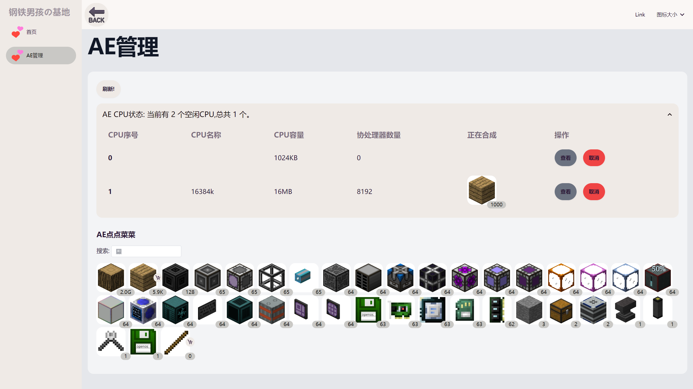
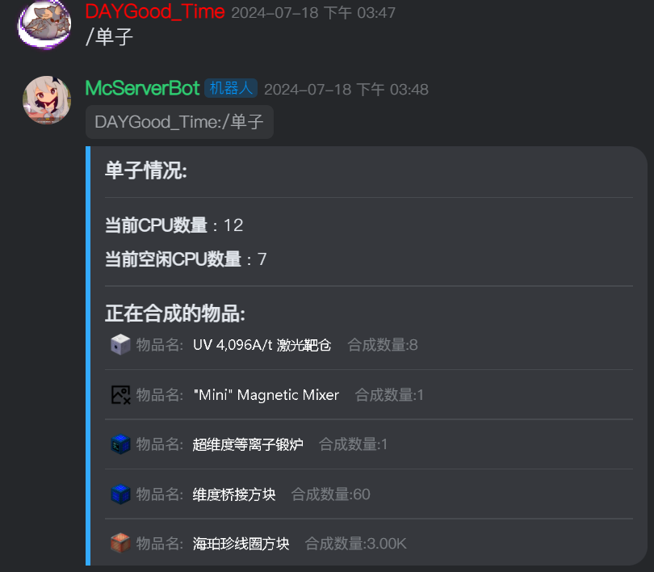

# OCRemote new

> 我(上游仓库作者)自己用的 GTNH [性能优化方案](docs/performance.md)

**现在该分支用于无线能源之前的系统架构，并打算重写服务端和前端**

## 部署

> 如果你是用上游仓库，那请回上游仓库查看。

### 项目四个文件夹的介绍

- `OC` 为动态执行的 lua 脚本，会在后端初始化时候向游戏内运行文件内的所有代码。
- `OCServer` 为游戏内 OC 电脑需要执行的文件，你需要通过复制粘贴或者 wget 将其中的两个文件上传到游戏内
- `OCRemoteServer` 为与游戏内对接的 Java 后端，你需要用 *爪哇* 运行它
- `oc-remote-web` 测试当中的web页面，由vue编写，需要自行部署。

### 安装教程

- 一个java jdk 或 jre (你跑GTNH怎么可能会没有？)
- 从 NEI 找到数据存储 导出物品面板 128*128 png 。将导出的文件夹放到 `OCRemote` 中，既这个目录下有`OC`、`OCServer`等文件夹的地方。
- 如果 MC 服务端和运行此项目不是在同一台主机运行，你需要在 `OCServer/server2.lua` 修改 http 地址，如果你需要修改端口，可以在 `OCRemoteServer\src\main\resources\app.yml` 内修改。(改完需要重新编译)
- 将 OCServer 下的文件 全部弄到游戏内，运行 OCServer
- 在`OCRemoteServer`有一份编译好的jar，用`java -jar 文件名` 就可以运行后端了。
- 修改 OC 配置文件 `允许访问本地 ip，解除内存限制（或者使用魔法内存），CPU 加速（我不知道是否需要）`，本项目根目录带了一份可以用的 `OpenComputers.cfg`(貌似不改的话，会导致服务端假死)
- 修改 `OC/energy_station.lua` , 里面有一个字符串地址。将其改为接到兰博顿能源站的适配器的地址。
- (可选)进入`oc-remote-web`目录,如果你有npm环境，那么可以直接`npm run preview` 或 `npm run dev`（开发模式) 打开web页面。如果没有，emm，要不装一个。或者想办法部署dist文件内的编译文件。不部署web页面也可以使用api
- `itempanel.csv`文件暂时不需要了，但是以后可能还会需要。目前项目自带一个 `GTNH-2.5.1` + `tst 0.49.27` 的nei导出。
- 运行，如果要运行在公网可以反代

### api

> 因为后端是完全独立出来的部分，你可以使用后端的api实现任意终端的访问和显示。例如机器人。

[接口文档](OCRemoteAPI.html)

## Showcase

使用机器人远程查看合成状态

